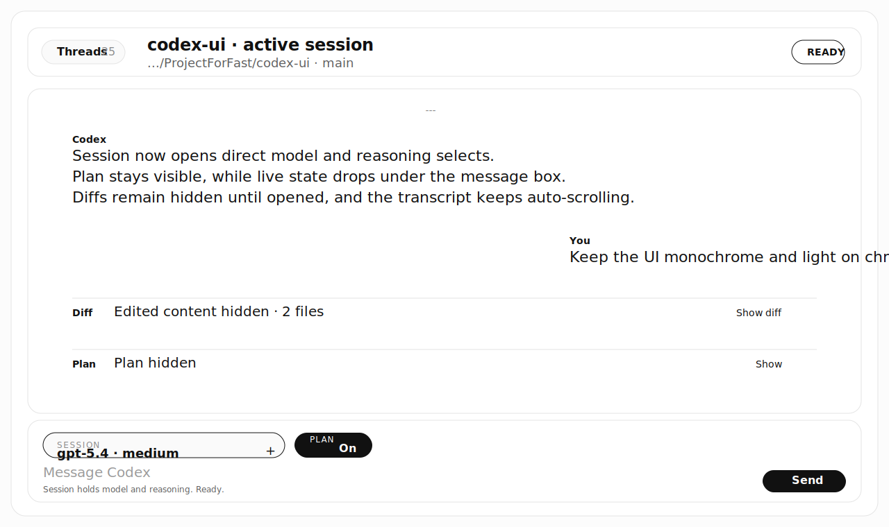
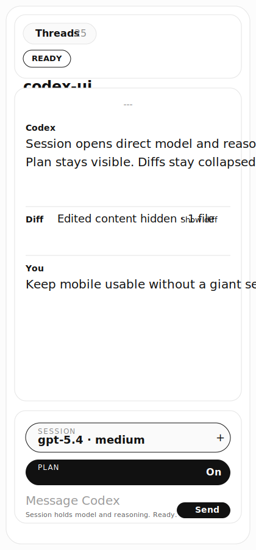

# Codex UI

[English](./README.md) | [한국어](./README.ko.md)


실제 `codex app-server`를 위한 흑백 로컬 채팅 UI입니다.

이 프로젝트는 Codex를 일반적인 챗봇처럼 포장하지 않습니다. 흰 배경, 검은 타이포, 얇은 선, 실시간 스트리밍, 기본 접힘 diff, 입력창 바로 옆 세션 제어만 남기고 나머지 장식은 덜어냈습니다.

## Preview

| Desktop | Mobile |
| --- | --- |
|  |  |

## 왜 만들었나

- 긴 Codex 세션은 대시보드보다 읽기 좋은 transcript가 더 중요합니다.
- 많은 래퍼 UI가 모델 설정, plan mode, approval을 엉뚱한 위치에 숨깁니다.
- 이 UI는 필요한 제어를 composer 근처에 두고, 나머지 화면은 대화 자체에 집중하게 만듭니다.

## 제품 방향

- composer 안의 `Session` 드롭다운에서 `Model`, `Reasoning`, `Transcript`, `Status`, `Shortcuts` 제어
- `Session` 안에서 다시 중첩 메뉴를 열지 않고 바로 고르는 select 기반 설정
- 드롭다운과 별도로 항상 보이는 `Plan` 토글 버튼
- 별도 상태 카드 대신 입력창 아래에 붙는 인라인 상태 표시
- 오직 `---` 만으로 구분하는 turn 경계와 그룹화된 user/assistant 메시지
- 필요할 때만 펼치는 edited content와 reasoning 요약
- 실시간 스트리밍 중 자동으로 따라가는 transcript
- 모바일에서도 설정 UI가 입력창보다 더 커지지 않도록 조정된 밀도

## 핵심 특징

- 새로고침이 아닌 WebSocket 기반 실시간 업데이트
- 성공 로그는 숨기고, 에러와 approval만 남기는 최소한의 transcript 정책
- 검색, 정렬, 재개, 새 thread 생성을 포함한 로컬 thread drawer
- command, file edit, permission, `request_user_input`까지 브라우저 안에서 처리
- 저장소 내부 bridge와 generated protocol type을 그대로 사용

## 아키텍처

```text
Browser UI
  ├─ Next.js app router shell
  ├─ WebSocket snapshot stream (/ws)
  └─ HTTP actions (/api/*)

Local bridge
  ├─ server/index.ts
  └─ server/codex-bridge.ts
       └─ codex app-server over stdio JSON-RPC
```

## 빠른 시작

```bash
npm install
npm run dev
```

브라우저에서 `http://127.0.0.1:3000` 을 열면 됩니다.

## 요구사항

- Node.js 20+
- `PATH` 에 있는 `codex`
- 로그인된 로컬 Codex 세션

## 사용 흐름

1. 앱을 시작하고 `Threads` 에서 기존 세션을 열거나 새로 만듭니다.
2. composer 옆 `Session` 을 열어 `Model` 과 `Reasoning` 을 설정합니다.
3. 다음 turn에 plan collaboration mode가 필요하면 `Plan` 을 켭니다.
4. 메시지를 보내고 WebSocket으로 갱신되는 transcript를 그대로 따라갑니다.
5. diff는 필요할 때만 펼치고 approval은 같은 화면에서 처리합니다.

## 개발

```bash
npm run typecheck
npm run build
npm run check
```

## 참고

- thread drawer는 로컬 Codex 세션을 읽기 때문에 다른 워크스페이스의 thread도 보일 수 있습니다.
- 기본 주소는 `127.0.0.1:3000` 입니다.
- 포트를 바꾸려면 `PORT=3001 node --import tsx server/index.ts` 를 사용하면 됩니다.
