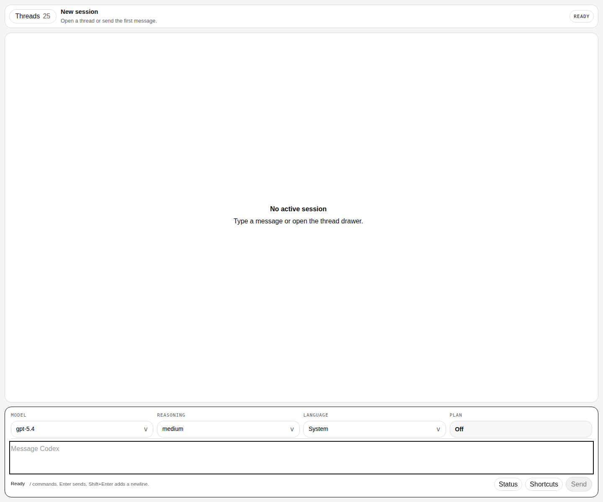
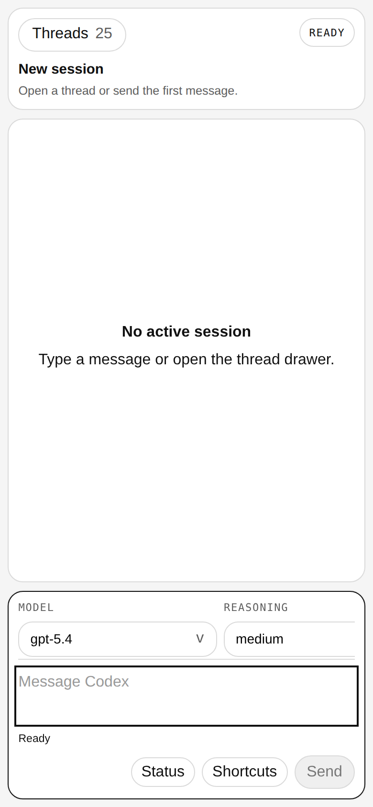

# Codex UI

[English](./README.md) | [한국어](./README.ko.md)


실제 `codex app-server`를 위한 흑백 transcript 중심 로컬 UI입니다.

`codex-ui`는 Codex를 시끄러운 대시보드로 바꾸지 않고, 원래의 작업 흐름에 가깝게 유지합니다. 흰 배경, 검은 타이포, 얇은 선, 직접 보이는 composer 제어, WebSocket 실시간 갱신, 기본 접힘 diff, 그리고 데스크톱과 모바일 모두에서 대화가 가장 크게 보이는 구조만 남겼습니다.

## Preview

| Desktop | Mobile |
| --- | --- |
|  |  |

## 이 UI가 최적화하는 것

- transcript 우선. 대화면이 가장 크고 가장 읽기 쉬워야 합니다.
- 최소한의 chrome. 상태, 단축키, thread 관리 UI는 가볍게 유지합니다.
- 직접 제어. `Model`, `Reasoning`, `Language` 는 composer 안에서 바로 고르는 드롭다운입니다.
- 모바일 control rail. 작은 화면에서는 같은 제어가 transcript를 밀어내지 않도록 composer 안의 가로 레일로 유지됩니다.
- 한 번의 계획 전환. `Plan` 모드는 입력 흐름 옆에 항상 있는 버튼으로 둡니다.
- 안정적인 출력. thread를 다시 불러올 때와 실시간 업데이트할 때 같은 item-to-transcript 정규화 경로를 따릅니다.
- 적은 잡음. edited content는 기본 접힘이고, 런타임 잡음은 숨기며, 의미 있는 상태만 남깁니다.

## 핵심 UX

- 새로고침 폴링이 아닌 WebSocket 기반 실시간 업데이트
- 검정/흰색만 사용하는 절제된 시각 체계와 얇은 테두리 중심 UI
- composer 안의 직접 드롭다운으로 `Model`, `Reasoning`, `Language` 제어
- 모바일에서도 transcript를 더 크게 유지하는 compact control rail
- 메뉴에 숨기지 않은 composer 내부 `Plan` 토글 버튼
- `---` 만 사용하는 turn 구분과 user/assistant 메시지 그룹화
- 기본 접힘 diff와 저잡음 이벤트 렌더링, 필요할 때만 펼치는 구조
- 스트리밍 중 자동으로 최신 transcript를 따라가는 스크롤 동작
- 모바일에서도 composer보다 transcript가 더 크게 보이는 비율 유지
- 검색, 정렬, 재개, 새 thread 생성을 포함한 로컬 thread drawer
- command, file change, permission, `request_user_input` 를 브라우저 안에서 바로 처리

## 아키텍처

```text
Browser UI
  ├─ Next.js app router shell
  ├─ WebSocket snapshot stream (/ws)
  └─ HTTP actions (/api/*)

Local bridge
  ├─ server/index.ts
  └─ server/codex-bridge.ts
       ├─ codex app-server over stdio JSON-RPC
       └─ live delta 와 thread/read 를 함께 쓰는 정규화 계층
```

## 빠른 시작

```bash
npm install
npm run dev
```

브라우저에서 `http://127.0.0.1:3000` 을 열면 됩니다.

## 요구사항

- Node.js 20+
- `PATH` 에 있는 `codex`
- 로그인된 로컬 Codex 세션

## 사용 흐름

1. 앱을 시작하고 `Threads` 에서 기존 thread를 열거나 새로 만듭니다.
2. composer 제어줄에서 `Model`, `Reasoning`, `Language` 를 바로 선택합니다.
3. 다음 turn을 plan collaboration mode로 보내고 싶다면 `Plan` 버튼을 토글합니다.
4. 메시지를 보내고 WebSocket으로 갱신되는 transcript를 그대로 따라갑니다.
5. 필요할 때만 `Status` 와 `Shortcuts` 를 열고, transcript는 메인 화면에 그대로 둡니다.
6. diff는 필요할 때만 펼치고 approval은 같은 흐름 안에서 처리합니다.

## 개발

```bash
npm run typecheck
npm run build
npm run check
```

## 참고

- thread drawer는 로컬 Codex 세션을 읽기 때문에 다른 워크스페이스의 thread도 보일 수 있습니다.
- 기본 주소는 `127.0.0.1:3000` 입니다.
- 포트를 바꾸려면 `PORT=3001 node --import tsx server/index.ts` 를 사용하면 됩니다.
