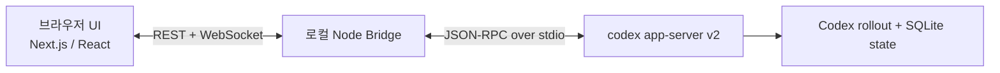

# Codex WebUI

[English](./README.md) | [한국어](./README.ko.md)

[](https://github.com/smturtle2/codex-ui/stargazers)


`codex app-server v2`를 위한 ChatGPT 스타일의 로컬 WebUI입니다.

이 프로젝트는 Codex를 시스템 오브 레코드로 유지합니다. raw stdout를 스크랩하지 않고, Codex 엔진을 재구현하지 않으며, 별도의 세션 모델을 억지로 만들지 않습니다. UI는 `thread`, `turn`, `item`, `diff`, `review`, `server request` 같은 Codex 고유 개념 위에서 동작합니다.

`codex-cli`를 위한 잘 만든 로컬 UI를 찾고 있다면 이 저장소가 출발점입니다. 도움이 된다면 스타를 눌러 주세요.

## 가장 빠른 시작 방법

```bash
npm run up
```

이 한 줄이 다음을 처리합니다.

- 로컬 런타임 점검
- 필요 시 npm 의존성 설치
- `codex-cli` 확인
- 앱 실행
- 서버 준비 후 브라우저 자동 열기

## 왜 필요한가

대부분의 에이전트 래퍼는 모든 것을 일반적인 채팅 스트림으로 평탄화합니다. Codex에는 그 방식이 충분하지 않습니다.

Codex WebUI는 다음을 목표로 합니다.

- 실제 `codex app-server` 계약을 그대로 유지
- raw stdout 파싱 없이 승인, diff, review, logs, turn 상태를 UI로 노출
- 브라우저와 Codex 사이에 장수명 로컬 브리지를 하나만 유지
- ChatGPT처럼 익숙하게 보이되, 내부 구조는 Codex에 충실하게 유지

## 핵심 특징

- 사이드바, 중앙 대화, 고정 composer, 우측 패널로 구성된 ChatGPT 스타일 셸
- `codex app-server --listen stdio://` child process 하나를 소유하는 단일 로컬 Node bridge
- 스냅샷 + 증분 이벤트 + replay/resync를 포함한 typed realtime 모델
- command approval, file change approval, permissions approval, `request_user_input`, MCP elicitation을 처리하는 pending request 센터
- Codex-native 이벤트 기반 diff / review 패널
- model, approval policy, sandbox mode, web search를 다루는 account bootstrap 및 quick config controls
- bridge 로그와 Codex JSON stderr tracing을 함께 보여주는 logs 패널
- 고정 schema fixture와 contract check를 포함한 `codex-cli` 호환성 게이트
- session secret, Host 검사, Origin 검사 기반의 로컬 보안 모델

## 현재 범위

v1은 의도적으로 범위를 제한합니다.

- 로컬 단일 사용자 제품
- 브라우저 앱 하나, 로컬 bridge 하나, `codex app-server` child process 하나
- 원격 SaaS 배포 계층 없음
- 멀티유저 인증 및 RBAC 없음
- plugin marketplace UI 없음
- composer에서 이미지 외 임의 파일 업로드 없음

## 빠른 시작

### 요구 사항

- Node.js 20+
- `npm`
- `PATH`에서 실행 가능한 `codex-cli 0.114.x`
- 정상 동작하는 Codex 로그인 세션 또는 API key 기반 Codex 환경
- Codex CLI 기준 지원 환경: macOS 12+, Ubuntu 20.04+/Debian 10+, Windows 11 via WSL2

bare Windows는 현재 지원 대상이 아닙니다.

### 1. Codex 버전 확인

```bash
codex --version
```

full support를 받으려면 `0.114.x`가 필요합니다.

### 2. 원커맨드 실행

```bash
npm run up
```

의존성이 없으면 런처가 먼저 설치합니다.

### 3. 선택 가능한 setup / 진단 명령

```bash
npm run setup
npm run doctor
```

- `npm run setup`: 빠진 의존성을 설치하고 환경을 점검
- `npm run doctor`: 이슈에 붙여 넣기 쉬운 진단 결과 출력

### 4. 수동 실행 방식

기존처럼 직접 설치하고 띄우고 싶다면:

```bash
npm install
npm run dev
```

브라우저에서 `http://127.0.0.1:3000`을 엽니다.

프로덕션 스타일 실행은 build를 자동으로 포함합니다.

```bash
npm run start
```

### 선택 가능한 환경 변수

- `HOST` 기본값: `127.0.0.1`
- `PORT` 기본값: `3000`
- `CODEX_HOME`, `CODEX_SQLITE_HOME`을 직접 지정할 수 있음

## 호환성

| `codex-cli` 버전 | 상태 | 동작 |
| --- | --- | --- |
| `0.114.x` | Full support | `experimentalApi=true`, extended history 활성화 |
| `> 0.114.x` | Degraded support | stable surface만 사용, experimental 기능 비활성화 |
| `< 0.114.0` | 실행 차단 | 시작 시 호환성 오류 반환 |

프로젝트에는 `0.114.0` 기준 protocol fixture와 schema drift를 잡기 위한 검사 스크립트가 포함되어 있습니다.

## 아키텍처



핵심 결정은 다음과 같습니다.

- `codex app-server --listen stdio://`만 사용
- 브라우저가 Codex에 직접 붙지 않도록 설계
- 상태 모델을 `thread`, `turn`, `item`, `server request` 중심으로 유지
- Codex rollout + SQLite를 system of record로 간주
- raw terminal stdout를 주 UI 프로토콜로 사용하지 않음

bridge 내부 모듈:

- `ProcessSupervisor`
- `JsonRpcClient`
- `ThreadRegistry`
- `PendingRequestRouter`
- `BrowserSessionHub`
- `AccountConfigService`
- `DiagnosticsLogger`

## 현재 가능한 것

- workspace 또는 git root 기준으로 인간 주도 Codex thread 탐색
- 새 thread 시작, 기존 thread 다시 열기 및 resume
- typed turn / item 업데이트를 중앙 대화에 스트리밍
- activity, pending requests, diff, review, logs 패널 확인
- composer에서 text, `localImage`, skill, mention 입력 전송
- UI에서 Codex approval 응답
- inline review / detached review 실행
- settings 패널에서 주요 config 값 일부 변경

## 개발

### 스크립트

```bash
npm run setup
npm run doctor
npm run up
npm run up -- --no-open
npm run dev
npm run build
npm run start
npm test
npm run test:unit
RUN_CODEX_INTEGRATION=1 npm run test:integration
node scripts/check-codex-schema.mjs
```

### 테스트 계층

- version gate, reducer, parser, retry logic에 대한 unit 테스트
- `codex-cli 0.114.0` 기준 실제 app-server integration 테스트
- protocol drift 확인용 schema fixture 체크

## 보안 모델

이 앱은 로컬 환경 전용으로 설계되어 있습니다.

- 기본적으로 `127.0.0.1`에만 bind
- 실행 시 무작위 session secret 생성
- REST 요청은 `x-codex-webui-session`으로 보호
- WebSocket upgrade는 session secret과 Origin 검사로 보호
- 예상하지 않은 `Host`, `Origin` 헤더 거부
- Codex credential을 브라우저 저장소에 저장하지 않음

## 디렉터리 구조

```text
server/                      커스텀 로컬 엔트리포인트
src/app/                     Next.js app router 셸
src/components/              UI 셸과 패널
src/server/bridge/           로컬 bridge 및 프로토콜 처리
src/lib/                     공용 타입, reducer, parser, version gate
tests/                       unit / integration 테스트
fixtures/codex-app-server/   고정 protocol schema
```

## 로드맵

- reconnect 시나리오와 E2E 커버리지 강화
- thread 관리 흐름 UI 확장
- review / recovery / accessibility 품질 향상
- 더 쉬운 로컬 설치 패키징

## 기여

이슈, 버그 리포트, UX 피드백, protocol 분석, PR 모두 환영합니다.

특히 지금 가치가 큰 기여는 다음과 같습니다.

- 더 최신 `codex-cli` 버전에서 재현 가능한 호환성 버그 제보
- 고빈도 코딩 워크플로우를 위한 UX 개선
- approval / diff / review 사용성 개선
- 실제 `codex app-server` 동작을 검증하는 테스트 추가

이 프로젝트를 Codex의 대표 WebUI로 키우고 싶다면 가장 간단한 도움은 아래입니다.

1. 저장소에 스타를 누르기
2. 구체적인 문제나 아이디어로 이슈 열기
3. Codex를 이미 쓰고 있는 사람들에게 프로젝트 공유하기
