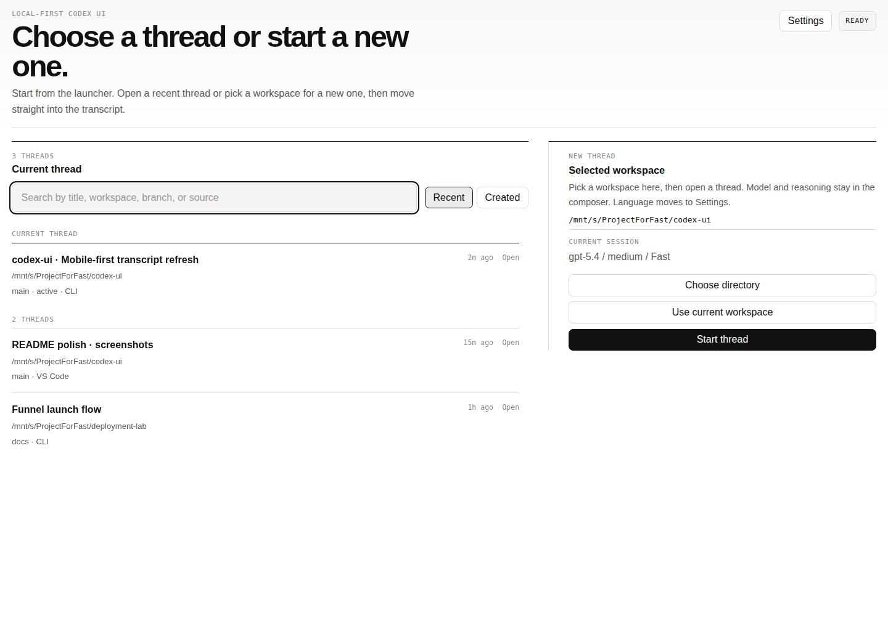
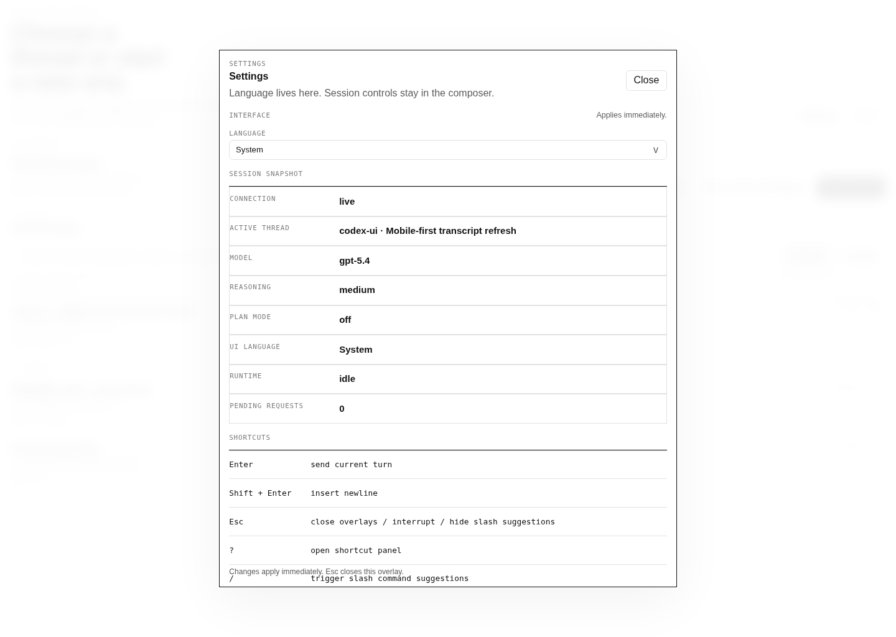
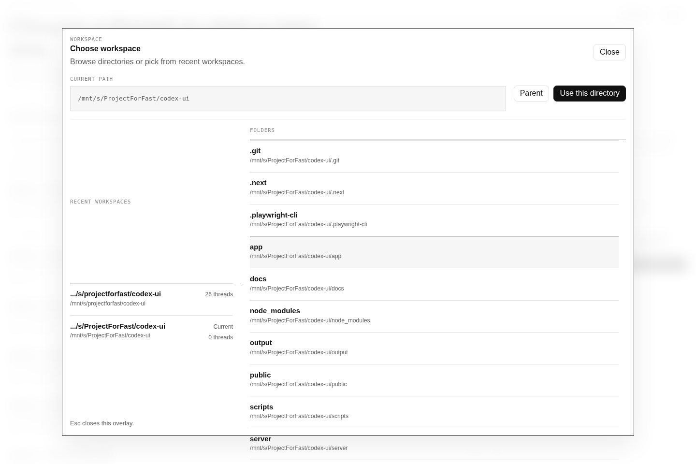
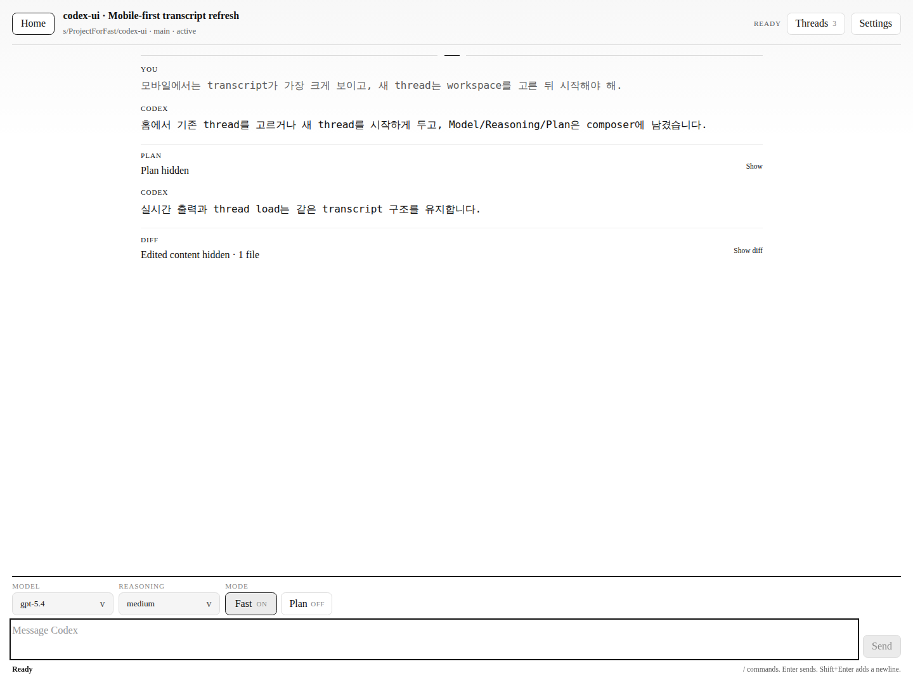
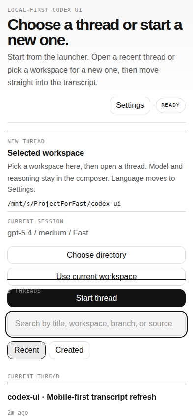
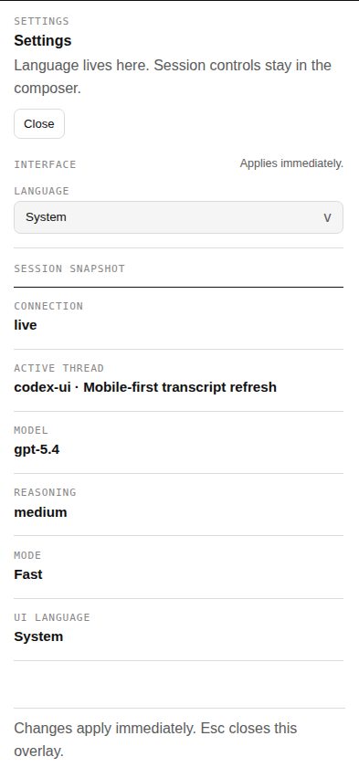
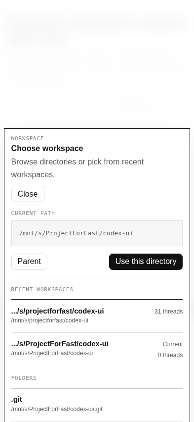
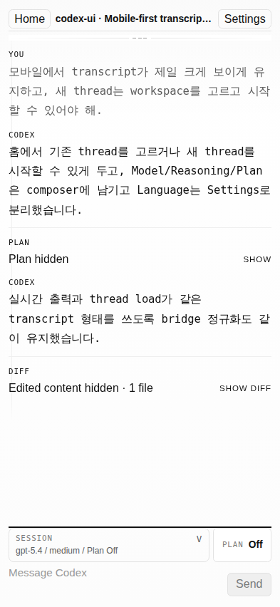

# Codex UI

[English](./README.md) | [한국어](./README.ko.md)


실제 `codex app-server`를 위한 흑백 transcript 중심 로컬 UI입니다.

`codex-ui`는 Codex를 대시보드처럼 과하게 포장하지 않고, 터미널에 가까운 흐름을 브라우저로 옮깁니다. 런처 화면에서 시작하고, 새 thread를 만들기 전에 workspace를 고를 수 있으며, `Model`, `Reasoning`, `Plan`은 채팅 입력부에 두고, 언어는 별도 설정 패널로 분리하며, WebSocket 스트리밍과 히스토리 로딩이 같은 transcript 구조를 유지합니다.

상세 변경 내역은 [RELEASE_NOTES.md](./RELEASE_NOTES.md)에 정리했습니다.

## Preview

### Desktop

<table>
  <tr>
    <td align="center"><strong>Home</strong></td>
    <td align="center"><strong>Settings</strong></td>
  </tr>
  <tr>
    <td></td>
    <td></td>
  </tr>
  <tr>
    <td align="center"><strong>Workspace Picker</strong></td>
    <td align="center"><strong>Desktop Chat</strong></td>
  </tr>
  <tr>
    <td></td>
    <td></td>
  </tr>
</table>

### Mobile

<table>
  <tr>
    <td align="center"><strong>Home</strong></td>
    <td align="center"><strong>Settings</strong></td>
  </tr>
  <tr>
    <td></td>
    <td></td>
  </tr>
  <tr>
    <td align="center"><strong>Workspace Picker</strong></td>
    <td align="center"><strong>Chat</strong></td>
  </tr>
  <tr>
    <td></td>
    <td></td>
  </tr>
</table>

## 핵심 특징

- 런처 우선 흐름: 전용 홈 화면에서 기존 thread를 열거나 새 thread를 시작합니다.
- 모바일 quick start: 좁은 화면에서도 `Start thread`와 workspace 선택이 thread 목록 위에 바로 보입니다.
- 전용 workspace picker: 경로를 직접 입력하지 않고 디렉토리를 탐색해서 선택합니다.
- transcript 우선 셸: 채팅 영역이 가장 크게 보이고, 메시지는 flat row로 유지되며, turn은 문자 대신 얇은 시각적 구분선으로 나뉩니다.
- 직접 세션 제어: `Model`, `Reasoning`, `Plan`을 composer 안에서 바로 바꾸고, 모바일에서도 compact strip과 즉시 누를 수 있는 `Plan` 토글을 유지합니다.
- 전용 설정 패널: 언어 설정은 채팅 입력부가 아니라 별도 settings surface에서 관리합니다.
- 실시간 일관성: bootstrap, `thread/read`, live streaming이 같은 transcript 구조와 approval 삽입 지점을 유지합니다.
- 모바일 재구성: 홈에서는 thread 선택과 새 thread 시작을 동시에 바로 보여주고, 채팅은 최신 출력까지 자동 스크롤되며, settings/workspace surface는 모바일 시트처럼 동작합니다.
- Tailscale Funnel 플래그: `--funnel`만 붙이면 한 줄 실행으로 외부 공개까지 연결됩니다.

## 아키텍처

```text
Browser UI
  ├─ Next.js app router shell
  ├─ WebSocket snapshot stream (/ws)
  └─ HTTP actions (/api/*)

Local bridge
  ├─ server/index.ts
  └─ server/codex-bridge.ts
       ├─ codex app-server over stdio JSON-RPC
       └─ bootstrap, thread/read, live delta를 함께 쓰는 정규화 계층
```

## 요구사항

- Node.js 20+
- `PATH`에 있는 `codex`
- 로그인된 로컬 Codex 세션
- `--funnel` 사용 시: `tailscale`, `bash`, `python`, `curl`

## 빠른 시작

```bash
npm run up
```

브라우저에서 `http://127.0.0.1:3000`을 열면 됩니다.

## 외부 접속

Tailscale Funnel로 로컬 UI를 한 줄로 외부에 공개할 수 있습니다.

```bash
npm run up -- --funnel
```

- `--funnel`은 `npm run dev -- --funnel`, `npm run start -- --funnel`에서도 동일하게 사용할 수 있습니다.
- `npm run up -- --funnel`은 의존성 설치, 로컬 서버 실행, repo-local Funnel helper 실행까지 한 번에 처리합니다.
- 현재 tailnet 노드에 Funnel이 아직 활성화되지 않았다면 helper가 바로 enable URL을 출력합니다.
- `npm run funnel:status`로 현재 Funnel 매핑을 확인할 수 있습니다.
- `npm run funnel:off`로 이 노드의 Funnel 설정을 초기화할 수 있습니다.

참고 문서:
- [Tailscale Funnel docs](https://tailscale.com/kb/1223/tailscale-funnel/)
- [Tailscale CLI funnel reference](https://tailscale.com/docs/reference/tailscale-cli/funnel)

## 개발

```bash
npm run typecheck
npm run build
npm run check
python scripts/generate_preview_images.py
```

`python scripts/generate_preview_images.py`를 실행하면 README에 쓰는 데스크톱/모바일 스크린샷 세트를 다시 생성합니다.
