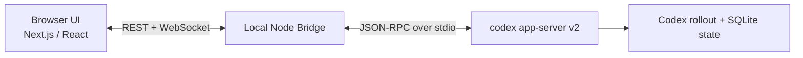

# Codex WebUI

[English](./README.md) | [한국어](./README.ko.md)

[](https://github.com/smturtle2/codex-ui/stargazers)


ChatGPT-like local WebUI for `codex app-server v2`.

This project keeps Codex as the source of truth. It does not scrape raw stdout, does not reimplement the Codex engine, and does not invent a second session model. The UI is built around Codex-native primitives such as threads, turns, items, diffs, reviews, and server requests.

If you want a polished, open, local-first UI for `codex-cli`, start here. If this project is useful, star the repo and share it.

## Why This Exists

Most wrappers around coding agents flatten everything into a generic chat stream. That is not enough for Codex.

Codex WebUI is designed to:

- preserve the real `codex app-server` contract
- show approvals, diffs, reviews, logs, and turn state without raw stdout parsing
- keep one long-lived local bridge process between the browser and Codex
- feel familiar to ChatGPT users while staying honest to Codex internals

## Highlights

- ChatGPT-like shell with sidebar, central conversation, fixed composer, and right-side panels
- Single local Node bridge that owns one long-lived `codex app-server --listen stdio://` child process
- Typed realtime model: thread snapshots plus incremental events with replay and resync behavior
- Pending request center for command approval, file change approval, permissions approval, `request_user_input`, and MCP elicitation
- Diff and review panels backed by Codex-native events
- Account bootstrap and quick config controls for model, approval policy, sandbox mode, and web search
- Logs panel for both bridge logs and Codex JSON stderr tracing
- Version gate for `codex-cli` compatibility with pinned schema fixtures and contract checks
- Local-only security model with session secret, Host checks, and Origin checks

## Current Scope

Codex WebUI is intentionally opinionated in v1:

- local single-user product
- one browser app, one local bridge, one `codex app-server` child process
- no remote SaaS deployment layer
- no multi-user auth or RBAC
- no plugin marketplace UI
- no arbitrary non-image file upload in the composer

## Quick Start

### Requirements

- Node.js 20+
- `npm`
- `codex-cli` `0.114.x` available on `PATH`
- a working Codex account session or API-key-capable Codex setup
- supported environments aligned with Codex CLI: macOS 12+, Ubuntu 20.04+/Debian 10+, or Windows 11 via WSL2

Bare Windows is not a supported target right now.

### 1. Verify Codex

```bash
codex --version
```

You should see `0.114.x` for full support.

### 2. Install dependencies

```bash
npm install
```

### 3. Start the app

```bash
npm run dev
```

Then open `http://127.0.0.1:3000`.

For a production-style run:

```bash
npm run build
npm run start
```

### Optional environment variables

- `HOST` defaults to `127.0.0.1`
- `PORT` defaults to `3000`
- `CODEX_HOME` and `CODEX_SQLITE_HOME` can be overridden if you manage Codex state outside the default location

## Compatibility

| `codex-cli` version | Status | Behavior |
| --- | --- | --- |
| `0.114.x` | Full support | `experimentalApi=true`, extended history enabled |
| `> 0.114.x` | Degraded support | stable surface only, experimental features disabled |
| `< 0.114.0` | Blocked | startup fails with a compatibility error |

The project includes pinned protocol fixtures for `0.114.0` and a schema check script to detect drift.

## Architecture



Key decisions:

- use `codex app-server --listen stdio://` only
- keep the browser disconnected from Codex directly
- model state around `thread`, `turn`, `item`, and `server request`
- treat Codex rollout and SQLite as the system of record
- never parse raw terminal stdout as the primary UI protocol

Bridge modules include:

- `ProcessSupervisor`
- `JsonRpcClient`
- `ThreadRegistry`
- `PendingRequestRouter`
- `BrowserSessionHub`
- `AccountConfigService`
- `DiagnosticsLogger`

## What You Can Do Today

- browse human-created Codex threads grouped by workspace or git root
- start a new thread or resume an existing one
- stream typed turn and item updates into the main conversation
- inspect activity, pending requests, diffs, reviews, and logs
- send text, `localImage`, skill, and mention inputs from the composer
- answer Codex approvals from the UI
- trigger inline or detached review
- adjust a few high-signal config values from the settings panel

## Development

### Scripts

```bash
npm run dev
npm run build
npm run start
npm test
npm run test:unit
RUN_CODEX_INTEGRATION=1 npm run test:integration
node scripts/check-codex-schema.mjs
```

### Test layers

- unit tests for version gates, reducers, parsing, and retry logic
- real app-server integration tests against `codex-cli 0.114.0`
- schema fixture checks for protocol drift

## Security Model

The app is meant to stay local.

- binds to `127.0.0.1` by default
- generates a random session secret on launch
- protects REST calls with `x-codex-webui-session`
- protects WebSocket upgrade with the session secret and Origin checks
- rejects unexpected `Host` and `Origin` headers
- never stores Codex credentials in browser storage

## Project Structure

```text
server/                      custom local entrypoint
src/app/                     Next.js app router shell
src/components/              UI shell and panels
src/server/bridge/           local bridge and protocol handling
src/lib/                     shared types, reducers, parsers, version gate
tests/                       unit and integration tests
fixtures/codex-app-server/   pinned protocol schemas
```

## Roadmap

- richer E2E coverage and reconnect scenarios
- more complete thread management flows in the UI
- stronger polish around review, recovery, and accessibility
- packaging for easier local installs

## Contributing

Issues, bug reports, UX critiques, protocol findings, and PRs are welcome.

The highest-value contributions right now are:

- reproducible compatibility bugs against newer `codex-cli` versions
- UX polish for high-volume coding workflows
- approval, diff, and review ergonomics
- tests that exercise real `codex app-server` behavior

If you want this project to become the default WebUI for Codex, the simplest help is still:

1. star the repository
2. open an issue with a concrete problem or idea
3. share the project with people already using Codex
