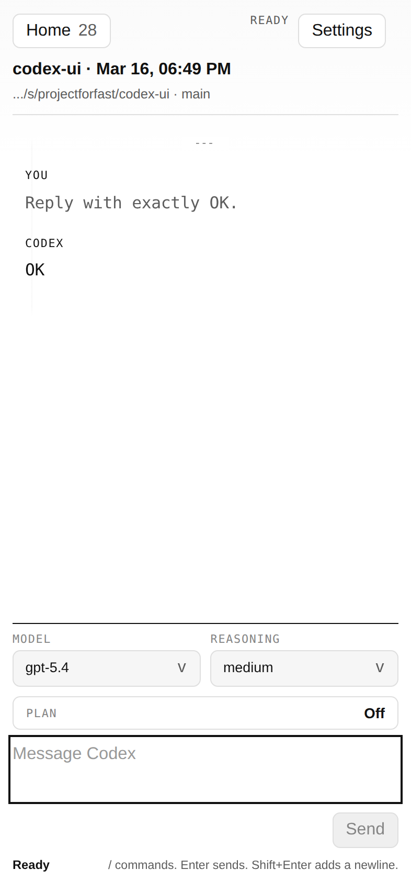

# Codex UI

[English](./README.md) | [한국어](./README.ko.md)


Monochrome, transcript-first local UI for the real `codex app-server`.

`codex-ui` keeps Codex close to its native workflow instead of turning it into a noisy dashboard. The shell stays intentionally strict: white background, black type, thin borders, direct session controls, live WebSocket updates, folded diffs, and a transcript that remains dominant on both desktop and mobile.

## Preview

| Desktop | Mobile |
| --- | --- |
|  |  |

## UX Audit

- The previous mobile layout spent too much height on always-open controls, so the composer now collapses session settings into a compact summary row on small screens.
- The transcript surface looked too boxed-in, so the shell now uses flatter rails and lets the conversation occupy more of the page.
- Loaded thread history and live updates could diverge around bootstrap and diff shaping, so the bridge now hydrates an active thread on bootstrap and merges turn-level file changes through the same transcript model.
- Low-signal runtime chatter stays folded or hidden by default, so only the conversation and meaningful exceptions stay visible.

## What This UI Optimizes For

- Transcript first. The conversation surface stays largest and easiest to scan.
- Flat transcript. Messages render as plain transcript blocks instead of chat cards.
- Minimal chrome. Status, shortcuts, and thread management stay lightweight.
- Direct control. `Model`, `Reasoning`, and `Language` live inside the composer as visible dropdowns.
- Mobile control rail. On small screens session controls collapse into a compact summary row instead of pushing the transcript down.
- One-click planning. `Plan` mode stays next to the input flow as a dedicated button.
- Stable output. Loaded threads and live updates normalize through the same item-to-transcript path, including turn-level file changes.
- Less noise. Edited content starts folded, runtime chatter stays hidden, and only meaningful states stay visible.

## Core UX

- Real-time thread updates over WebSocket. No refresh polling.
- Strict black/white visual system with compact borders and restrained spacing.
- Flat transcript rows with role labels instead of bubble cards.
- Composer control strip with direct selectors for `Model`, `Reasoning`, and `Language`.
- Compact mobile control rail that keeps session settings reachable without letting the composer dominate the screen.
- Dedicated `Plan` toggle inside the composer instead of burying it in a menu.
- `---` turn separators with grouped user and assistant messages.
- No inline transcript timestamps, so loaded threads and live output stay visually aligned.
- Hidden diffs and low-noise event rendering by default, with explicit reveal when needed.
- Automatic transcript follow mode while live output is streaming.
- Mobile layout keeps the transcript taller than the composer while preserving usable controls.
- Local thread drawer for search, sort, resume, and fresh-thread creation.
- Inline approvals for commands, file changes, permissions, and `request_user_input`.
- Bootstrap hydrates the active thread when available instead of showing an empty pane after reconnecting.

## Architecture

```text
Browser UI
  ├─ Next.js app router shell
  ├─ WebSocket snapshot stream (/ws)
  └─ HTTP actions (/api/*)

Local bridge
  ├─ server/index.ts
  └─ server/codex-bridge.ts
       ├─ codex app-server over stdio JSON-RPC
       └─ shared normalization for bootstrap hydration, thread/read, and live deltas
```

## Quick Start

```bash
npm install
npm run dev
```

Open `http://127.0.0.1:3000`.

## Requirements

- Node.js 20+
- `codex` on `PATH`
- an authenticated local Codex session

## Workflow

1. Start the app and open an existing thread from `Threads`, or create a fresh one.
2. Set `Model`, `Reasoning`, and `Language` directly in the composer control strip.
3. Toggle `Plan` when you want plan collaboration mode for the next turn.
4. Send a message and follow the transcript live over WebSocket.
5. Open `Status` or `Shortcuts` only when needed; the transcript remains the main surface.
6. Expand diffs only when needed and handle approvals inline.

## Development

```bash
npm run typecheck
npm run build
npm run check
```

## Notes

- The thread drawer reads local Codex sessions, so threads from other workspaces can appear.
- Default host and port are `127.0.0.1:3000`.
- Override the port with `PORT=3001 node --import tsx server/index.ts` if needed.
